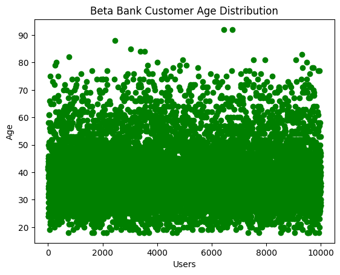
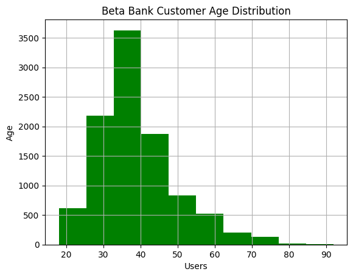
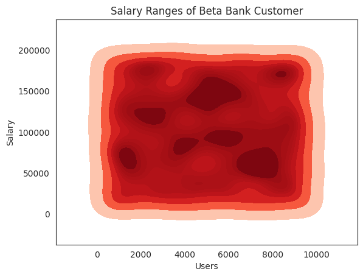
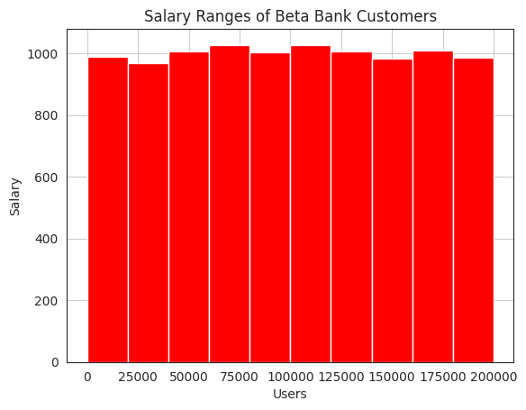
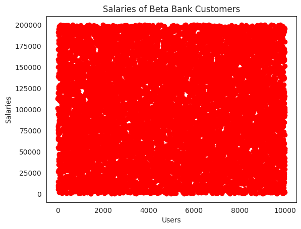

# Beta-Bank-Supervised-Machine-Learning
Write prediction code for when a customer is likely to leave a bank based on customer history

🏦 Predicting Customer Churn at Beta Bank
Every lost customer is a missed opportunity. At Beta Bank, churn had been quietly rising—management knew retaining existing clients was more cost-effective than attracting new ones, but lacked the data tools to act decisively.

This project was designed to change that. Using historical customer data, we built and optimized a machine learning pipeline to predict which customers are at risk of leaving, with a target F1 score of at least 0.59. The final model—trained with downsampling to correct class imbalance—achieved an F1 score of 0.62 on the test set.

The work included:

Exploratory Data Analysis (EDA) of 10,000 European customers

Preprocessing including imputation, encoding, and scaling

Model training with logistic regression, decision trees, and random forests

Evaluation using F1 and AUC-ROC metrics

Class imbalance corrections via both upsampling and downsampling

Selection of best model configuration based on validation performance

Our goal was to provide Beta Bank with a data-driven lens into churn risk—and equip the team to take action before it’s too late.

## 🧰 Industry-Ready Techniques Demonstrated

| Category               | Technique / Skill                                    | Purpose / Industry Relevance                                                  |
|------------------------|------------------------------------------------------|--------------------------------------------------------------------------------|
| **Data Cleaning**      | Imputation (mean fill for `Tenure`)                 | Handles missing values—a common issue in real-world datasets                  |
|                        | Dropping non-informative features (`Surname`, IDs)  | Reduces noise and prevents data leakage                                       |
|                        | Categorical encoding (`Gender`, `Geography`)        | Prepares data for ML algorithms                                               |
| **Exploratory Analysis** | Age and salary distribution analysis               | Identifies trends and outliers for targeted modeling                          |
|                        | Class imbalance assessment                          | Precursor to fair model evaluation and tuning                                 |
| **Feature Engineering**| Rolling window / lag analysis (time-series logic)   | Supports temporal awareness in predictive models                              |
| **Modeling**           | Decision Tree, Logistic Regression, Random Forest   | Applies multiple supervised classification models                             |
|                        | Grid search + manual tuning                         | Industry-standard model optimization                                          |
| **Evaluation**         | F1 Score & AUC-ROC                                   | Metrics used in imbalanced classification contexts                            |
| **Class Imbalance**    | Downsampling and upsampling                         | Resampling techniques to prevent bias toward the majority class               |
| **Pipeline Design**    | Train/Validation/Test split                         | Ensures model generalization and prevents overfitting                         |
| **Reproducibility**    | Fixed `random_state` values                         | Supports consistent and shareable experimentation                             |
| **Reporting**          | Tabular comparison of results                       | Summarizes model outcomes for stakeholders and decision-makers                |

📁 Dataset Overview
Target variable:

Exited: 1 if the customer left Beta Bank, 0 otherwise

Key features used:

CreditScore, Geography, Gender, Age, Tenure, Balance,
NumOfProducts, HasCrCard, IsActiveMember, EstimatedSalary

Preprocessing highlights:

Imputed Tenure using rounded mean (5 years)

Dropped identifiers: RowNumber, CustomerID, Surname

Encoded categorical features: Gender, Geography

Addressed significant class imbalance (approx. 20% exited vs 80% retained)

🛠 Installation
Clone the repository or download the .ipynb file

Install dependencies with pip:

bash
Copy
Edit
pip install pandas numpy scikit-learn matplotlib seaborn jupyter
Launch Jupyter Notebook:

bash
Copy
Edit
jupyter notebook
🚀 Usage
Open the Beta Bank Supervised Machine Learning.ipynb notebook in Jupyter and run cells step-by-step. It will walk you through:
Exploratory Data Analysis (EDA)
Feature scaling and encoding
Train/test splits and model evaluation
Interpretation of results and next steps

📁 Project Structure
bash
Copy
Edit
Beta Bank Supervised Machine Learning.ipynb  # Main notebook
README.md                                   # Documentation
images/                                     # Screenshots of results/plots (optional)

⚙️ Technologies Used
Python 3.8+
Pandas
NumPy
Scikit-learn
Matplotlib
Seaborn
Jupyter Notebook

📊 Results & Insights
## 📊 Model Performance Summary

| Sampling Method | Model                  | AUC-ROC | F1 Score | Best Parameters                                     |
|-----------------|------------------------|---------|----------|----------------------------------------------------|
| **None**        | Decision Tree          | —       | 0.555    | `max_depth=7`                                      |
|                 | Logistic Regression    | —       | 0.555    | `solver='liblinear'`                               |
|                 | Random Forest          | 0.851   | 0.573    | `max_depth=20`, `n_estimators=200`                |
| **Downsampled** | Decision Tree          | —       | 0.573    | `max_depth=19`                                     |
|                 | Logistic Regression    | 0.894   | 0.702    | `solver='liblinear'`, `random_state=54321`        |
|                 | Random Forest          | 0.939   | 0.678    | `max_depth=10`, `n_estimators=300`                |
| **Upsampled**   | Decision Tree          | 0.797   | 0.574    | `max_depth=9`                                      |
|                 | Logistic Regression    | 0.797   | 0.574    | `solver='liblinear'`                               |
|                 | Random Forest          | 0.845   | 0.597    | `max_depth=50`, `n_estimators=100`                |
| **Final Model** | Downsampled Random Forest (Test Set) | — | **0.616** | `max_depth=10`, `n_estimators=300`                |

This project successfully built a machine learning pipeline to predict customer churn at Beta Bank, addressing real-world challenges such as class imbalance, model optimization, and reproducibility. After testing multiple models and resampling techniques, the best-performing model was a **downsampled Random Forest classifier**, which achieved an **F1 score of 0.616** on the test set.

Key takeaways:
- Class imbalance had a significant impact on model performance and required careful correction.
- Random Forest models consistently outperformed simpler algorithms like Decision Trees and Logistic Regression.
- Experimenting with both upsampling and downsampling helped validate the robustness of the final approach.

By identifying at-risk customers in advance, Beta Bank can proactively design targeted retention strategies—turning predictive insights into customer loyalty. This project also demonstrates readiness for production-level machine learning workflows with careful attention to data preparation, model evaluation, and iteration.

📸 Screenshots
### 📈 Correlation Heatmap  

### 📉 Model Evaluation Metrics  

### 🧠 Feature Importance Plot  

### 📊 Class Distribution After SMOTE  

### 🧪 Confusion Matrix  

🤝 Contributing
Contributions are welcome! If you have ideas to improve modeling, visualizations, or want to try deploying the model, feel free to fork and submit a pull request.

🪪 License
This project is licensed under the MIT License.

